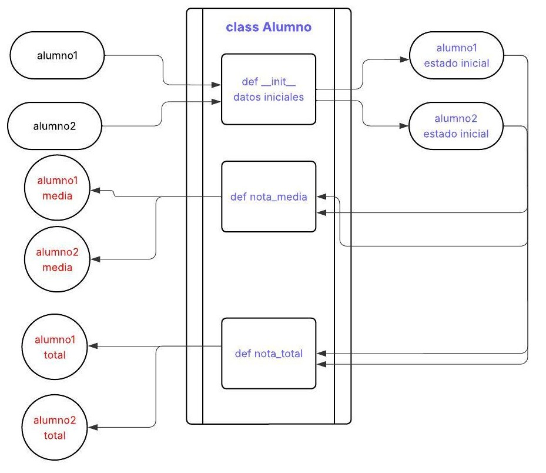
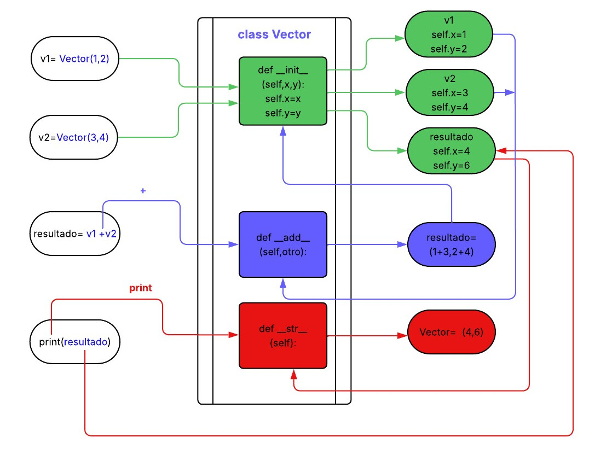
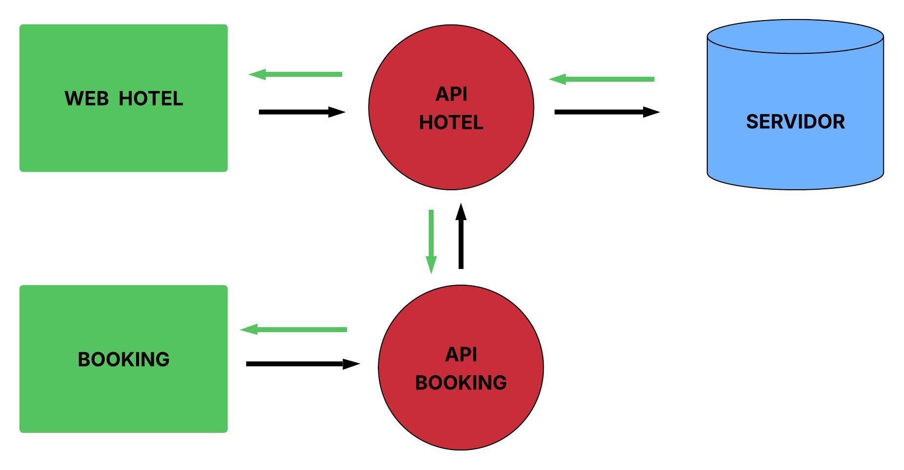
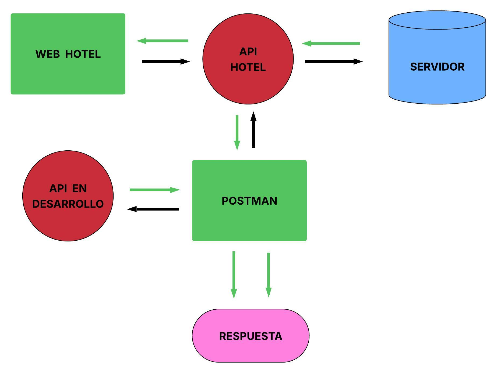

Mario Olmeño
<div style="text-align:center";>
<h1><strong>CHECKPOINT 6</strong></h1>
</div>

<div style="text-align:center";>
<h2> <strong>DOCUMENTACIÓN TEÓRICA.</strong></h2>
</div>

<div>
    <h3> <strong>1-¿Para qué usamos clases en python?</strong></h3>

Una clase es un "espacio" de Python en el que se pueden empaquetar datos y comportamientos (funciones) de esos datos.  

Las clases en python se utilizan para mantener el código más ordenado y limpio, y para poder reutilizar los comportamientos definidos en ellas en diferentes partes de nuestro código o para crear diferentes objetos partiendo de una misma clase.  

La sintaxis comienza con la palabra dedicada **class** y el nombre de la clase con la inicial en mayúsculas, seguido de "**:**". A partir de ahí se añade el código que define los datos y comportamientos que queremos incluir.  

Generalmente la estructura de una clase se puede dividir en dos partes:  

-Por un lado los datos o elementos que van a definir el estado inicial de nuestro objeto.   
-Por otro lado los comportamientos a los que vamos a poder recurrir partiendo de los datos iniciales.  

Para la primera parte de definición del estado inicial, utilizamos la función específica para clases: **init**, que va a tener la siguiente sintaxis:  
  <p style="padding-left:250px"> <strong> __ init __(self,argumentos de la función):</strong> </p>

En el argumento inicial hay que usar la palabra dedicada **self**.  

Almacenar la clase en una variable se denomina "instanciar", y cada variable así creada es una instancia diferente de esa clase. El argumento **self** nos va a permitir asignar a cada instancia sus diferentes valores utilizando el mismo nombre común para todas ellas en las diferentes funciones presentes en las clases.

Como ejemplo vamos a crear una clase que nos de la nota total de diferentes alumnos


```python
class Alumno:
    def __init__(self,nombre,apellido,curso):
        self.nombre = nombre
        self.apellido = apellido
        self.curso= curso
        self.nota= 0

    def nota_total (self,nota):
        self.nota += nota
        return self.nota       
```

Tenemos la clase ***Alumno***, que por un lado almacena la identidad del alumno y el curso que está realizando, y asigna una nota inicial de partida = 0, y por otro nos permite calcular la suma de sus notas según vayamos introduciendo los resultados de sus exámenes.  
Podemos introducir los datos de diferentes alumnos, cada uno será una instancia en la que se almacenan sus datos y a partir de ellos poder ejecutar las funciones de nuestra clase. 


```python
alumno1 = Alumno("Antonio","Gómez","FullStack")
alumno2 = Alumno("Maria","Pérez","FullStack")
print(alumno1.nombre)
print(alumno2.nombre + " " +alumno2.apellido)
print(alumno1.nota)
print(alumno2.nota)
```

    Antonio
    Maria Pérez
    0
    0
    

Para cada alumno tenemos sus datos disponibles y además podemos ir ingresando el resultado de sus exámenes según los vaya realizando y el sistema irá ejecutando la función **nota_total** para realizar la suma y devolvernos el resultado total.


```python
alumno1.nota_total(7)
alumno2.nota_total(8)
alumno1.nota_total(6)
alumno2.nota_total(7)
print(alumno1.nota)
print(alumno2.nota)
```

    13
    15
    

<div>
    <h3> <strong>2-¿Qué método se ejecuta automáticamente cuando se crea una instancia de clase? </strong></h3>  
    
Cada vez que se crea una instancia de clase se ejecuta automáticamente la función **init**, asociando a cada instancia sus datos de partida, definidos en la función **init**.   
A partir de ahí podemos aplicar el comportamiento que queramos a nuestra instancia.  
Continuando con el ejemplo anterior, podemos obtener una lista con las notas del alumno, calcular la nota media o la nota total de cada uno de los alumnos.


```python
class Alumno:
    def __init__(self,nombre,apellido,curso):
        self.nombre = nombre
        self.apellido = apellido
        self.curso= curso
        self.notas= []

    def nota (self,nota):
        self.notas.append(nota)
        return self.notas  

    def nota_total(self):
        return sum(self.notas)

    def nota_media(self):
        return sum(self.notas)/len(self.notas)      


```


```python
alumno1 = Alumno("Antonio","Gómez","FullStack")
alumno2 = Alumno("Maria","Pérez","FullStack")
print(alumno1.nombre)
print(alumno2.nombre + " "+alumno2.apellido)
```

    Antonio
    Maria Pérez
    


```python
alumno2.nota(8)
alumno1.nota(6)
alumno2.nota(7)
alumno1.nota(7)
print(alumno1.notas)
print(alumno1.nota_total())
print(alumno1.nota_media())
print(alumno2.notas)
print(alumno2.nota_total())
print(alumno2.nota_media())
```

    [6, 7]
    13
    6.5
    [8, 7]
    15
    7.5
    

<h4 style="text-align:center">DIAGRAMA DE FLUJO DE UNA CLASE.</h4>  

En el siguiente diagrama de flujo podemos seguir la secuencia de código que tiene lugar en la **clase Alumno**.  
Al declarar ***alumno1*** y ***alumno2***, python los envía a la función **init** y los almacena con la información de partida que les aporta esta función.  
A partir de ahí podemos llamar a cualquier función dentro de la clase y esta utilizará ***alumno1*** y ***alumno2*** con la información almacenada por cada uno tras pasar por la función **init**.  

<div style="text-align:center";>
    
</div>

<div>
    <h3> <strong>3-¿Qué es un método dunder?</strong></h3>  

Los métodos dunder son exclusivos de las clases y permiten que las instancias de una clase reaccionen a determinadas instrucciones básicas de Python como si fueran objetos externos a la clase (objetos nativos de python).  
Vamos a ver un ejemplo para entenderlo mejor, utilizando el método  **__str__**. Este método nos permite ejecutar una instrucción **print** sobre una instancia de clase y que se comporte como lo haría con cualquier otro objeto.   

Primero vamos a utilizar **print** con un objeto nativo.


```python
alumno = "Antonio"
print(alumno)
```

    Antonio
    

A continuación vamos a hacer lo mismo pero utilizando una clase de tal forma que ***nombre*** pasa a ser una instancia de clase.


```python
class Nombre:
    def __init__(self,nombre):
        self.nombre = nombre
       

alumno= Nombre("Antonio")

print(alumno)
```

    <__main__.Nombre object at 0x0000026ABF18FCB0>
    

Como vemos el resultado no es el esperado, esto se debe a que **print** ya no está actuando sobre un objeto nativo sino sobre una instancia de clase.  
Aquí es donde interviene la función __str__ que le da a **print** la capacidad de actuar sobre alumno-instancia como si fuera alumno-objeto nativo.


```python
class Nombre:
    def __init__(self,nombre):
        self.nombre = nombre

    def __str__(self):
       return f"{self.nombre}"
       

alumno = Nombre("Antonio")

print(alumno)
```

    Antonio
    

En este caso __str__ convierte **print(alumno)** en **print(alumno.__str__())** que devuelve **self.nombre**.  
Por eso los métodos Dunder se conocen como métodos mágicos ya que otorgan poderes especiales a funciones básicas para modificar instancias dentro de una clase, como lo harían con un objeto nativo.    
Se denominan Dunder por "double underscore" ya que los podemos reconocer por tener siempre al comienzo y al final un doble guión bajo.  
Los métodos Dunder son métodos preestablecidos y cada uno tiene una función específica.

Algunos ejemplos son además de __init__ y __str__ que ya hemos visto, __add__, __len__...  
__init__ Al crear una instancia. Constructor (inicializa atributos).  
__str__	Al usar print(instancia). Imprime la instancia.  
__len__	Al usar len(instancia). Longitud de algo (como una lista)   
__add__	Al usar + entre instancias.	Suma personalizada. También hay para la resta, multiplicación, división...  

Vamos a ver el ciclo completo con un ejemplo en el que vamos a utilizar __init__, __add__ y __str__.  
Crearemos una clase llamada Vector, que sume dos vectores.   


```python
class Vector:
    def __init__(self, x, y):
        print(f"__init__ llamado con x={x}, y={y}")
        self.x = x
        self.y = y

    def __add__(self, other):
        print(f"__add__ llamado: self=({self.x},{self.y}), other=({other.x},{other.y})")
        return Vector(self.x + other.x, self.y + other.y)

    def __str__(self):
        return f"Vector({self.x}, {self.y})"
```

Vamos a asignar valores a dos vectores.


```python
v1 = Vector(1, 2)
v2 = Vector(3, 4)
```

    __init__ llamado con x=1, y=2
    __init__ llamado con x=3, y=4
    

Cuando declaramos ***v1*** y ***v2*** como instancias de la **clase Vector**, python entra en la **clase Vector** busca el dunder __init__ y lo ejecuta de tal forma que ***v1*** pasa a almacenar los valores **self.x=1** y **self.y =2**, y ***v2*** los valores **self.x=3** y **self.y =4**.  
También imprime un mensaje para que podamos seguirlo.

Vamos a asignar el resultado de la suma a la variable **resultado**.  


```python
resultado = v1 + v2
```

    __add__ llamado: self=(1,2), other=(3,4)
    __init__ llamado con x=4, y=6
    

Cuando le pedimos a Python que almacene en **resultado** el valor de la suma de ***v1*** + ***v2***, Python al ver el signo "+" detecta que ***v1*** es una instancia de **Vector** y busca el dunder __add__.  Convirtiendo **v1 + v2** en **v1.__add__(v2)**. Almacenando el resultado en **resultado**.   
Además al detectar la creación de **resultado** ejecuta otra vez el dunder __init__ asignándole **self.x=4** y **self.y=6**. 
También ejecuta el mensaje de aviso. 


```python
print(resultado)
```

    Vector(4, 6)
    

Cuando le pedimos a Python que imprima **resultado**, al detectar que es una instancia de **Vector**, entra en **Vector** y busca el método __str__, ejecutándolo e imprimiendo el valor guardado en **resultado** en el paso anterior.  
En el siguiente diagrama de flujo podemos seguir toda la secuencia.  

<h4 style="text-align:center">DIAGRAMA DE FLUJO DE UNA CLASE CON MÉTODOS DUNDER.</h4>

<div style="text-align:center";>
    
</div>

<h3> <strong>4-¿Qué es polimorfismo?</strong><h3>

Polimorfismo quiere decir, como su propio nombre indica, que puede adoptar muchas formas. Esto se puede traducir en python como la capacidad que tienen objetos de diferentes clases de responder de diferente manera a un mismo método común a todas ellas.  
El polimorfismo nos permite escribir código más genérico lo que lo hace más flexible y reutilizable.  

En el siguiente ejemplo, creamos la **clase Hola** que genera el saludo **Hola**. Esta será la clase "padre".  
Después creamos dos subclases enlazadas con la clase "padre" **Hola** y que van a alterar el comportamiento de la misma para las instancias de estas dos subclases.  
La subclase **Euskera** convertirá **Hola** en **Kaixo** y la subclase **Ingles** convertirá **Hola** en **Hi**.


```python
class Hola:
    def hola(self):
        return "Hola"

class Euskera(Hola):
    def hola (self):
        return "Kaixo"

class Ingles(Hola):
    def hola (self):
        return "Hi"

def saludar(alumno):
    print(f"{alumno.hola()}")

juan= Hola()
ion = Euskera()
john= Ingles()

saludar(juan)
saludar(ion)
saludar(john)
```

    Hola
    Kaixo
    Hi
    

<h3> <strong>5-¿Qué es un decorador?</strong></h3>

Un decorador es una función que toma otra función de entrada y devuelve una tercera función, podríamos decir que se "encapsula" una función dentro de un "decorador" que le añade otros comportamientos antes y/o después de ejecutar dicha función, pero sin alterar su código.  
Sirve para reducir el número de líneas de código y hacerlo más legible.  
Tomemos como ejemplo una función que calcula la suma de dos números.  


```python
def suma (a,b):
    return a + b

suma (3,4)
```


    7


Imaginemos que queremos envolver esta función en otra, que llamaremos **mi_decorador** que ejecute otras instrucciones antes y después de nuestra función suma.  


```python
def mi_decorador(funcion):
    def nueva_funcion(a,b):
        print(f"Vamos a aplicar la función {funcion.__name__} a los números ({a} y {b})")
        resultado = funcion(a,b)
        print(f"Después de aplicar la función {funcion.__name__} a los números ({a} y {b}), el resultado es:")
        return resultado
       
    return nueva_funcion

@mi_decorador
def suma (a,b):
    print("Realizamos la operación suma")
    return a + b

suma (3,4)
```

    Vamos a aplicar la función suma a los números (3 y 4)
    Realizamos la operación suma
    Después de aplicar la función suma a los números (3 y 4), el resultado es:
    


    7


De esta manera podríamos utilizar **mi_decorador** para las demás operaciones simplemente añadiéndoles al comienzo de su función @mi_decorador.  
Probamos con la función resta.


```python
@mi_decorador
def resta (a,b):
    print("Entra en función resta")
    return a - b

resta(4,3)
```

    Vamos a aplicar la función resta a los números (4 y 3)
    Entra en función resta
    Después de aplicar la función resta a los números (4 y 3), el resultado es:
    


    1


<h3><strong>6-¿Qué es una API?</strong></h3>

API es el acrónimo de Application Programming Interface, y es una herramienta que permite que dos aplicaciones se comuniquen entre sí permitiendo la realización de consultas entre ambas.  
Podríamos decir que es una especie de intermediario que permite que dos aplicaciones distintas intercambien datos.  

Cuando entramos en la web de un hotel para consultar la disponibilidad de habitaciones para una fecha concreta, hace falta una API que recoja nuestra petición la envíe a la base de datos de la web y nos devuelva esa información. En este caso la API es propia del hotel, y pondría en contacto la web del hotel con su propio servidor donde almacena los datos.  
En el caso de reservar la misma habitación a través de una plataforma como Booking, esta necesita su propia API que se comunica con la API del hotel para obtener información de habitaciones, reservas...

<div style="text-align:center";>
    
</div>

**Probemos un caso real: la web del Hotel Maria Cristina de Donostia-San Sebastián.**    
Entramos en la web del **Hotel Maria Cristina** y hacemos click en la opción **gallery**:  
La API del hotel envía la siguiente petición al servidor: 


```python
Request URL:
https://www.marriott.com/en-us/hotels/easlc-hotel-maria-cristina-a-luxury-collection-hotel-san-sebastian/photos/
Request Method:
GET
```

La dirección https que se envía se denomina **endpoint**. Un **endpoint** es una URL que la **API** en cuestión pone a nuestra disposición para acceder a una parte concreta de la base de datos. Los endpoints son las puertas que tenemos que conocer para acceder a donde queremos.  
Una vez recibida la URL el servidor accede a la petición y devuelve la siguiente respuesta a la API del hotel.  
Solo se adjunta el inicio del código a modo de ejemplo.  


```python
<title>Photos of Hotel Maria Cristina, a Luxury Collection Hotel, San Sebastian</title>
<link rel="icon" href="https://cache.marriott.com/Images/Mobile/MC_Logos/MarriottApple57x57.png" type="image/x-icon"/>

    
    <link rel="alternate" href="https://www.marriott.com/de/hotels/easlc-hotel-maria-cristina-a-luxury-collection-hotel-san-sebastian/photos/" hreflang="de"/>

    <link rel="alternate" hreflang="x-default" href="https://www.marriott.com/en-us/hotels/easlc-hotel-maria-cristina-a-luxury-collection-hotel-san-sebastian/photos/"/>
    <link rel="alternate" href="https://www.marriott.com/en-us/hotels/easlc-hotel-maria-cristina-a-luxury-collection-hotel-san-sebastian/photos/" hreflang="en-us"/>

    
    <link rel="alternate" href="https://www.marriott.com/ja/hotels/easlc-hotel-maria-cristina-a-luxury-collection-hotel-san-sebastian/photos/" hreflang="ja"/>

    
    <link rel="alternate" href="https://www.marriott.com/fr/hotels/easlc-hotel-maria-cristina-a-luxury-collection-hotel-san-sebastian/photos/" hreflang="fr"/>

    
    <link rel="alternate" href="https://www.marriott.com/es/hotels/easlc-hotel-maria-cristina-a-luxury-collection-hotel-san-sebastian/photos/" hreflang="es"/>
```

Esta sería la respuesta interna con la información de todo lo que se visualiza en la opción **gallery**.
La web traduce esta información tal como la visualizamos nosotros como respuesta al click en el botón **gallery**.

<div style="text-align:center";>
    
</div>

<h3><strong>7-¿Cuales son los 3 verbos de API?</strong></h3>

Las APIs utilizan diferentes verbos para comunicarse entre ellas. Los tres verbos principales son: GET, POST, PUT. 

GET: Solicita información.  
    Quiero ver las fotos de la galería.  

POST: Crea un nuevo recurso.
    Quiero consultar la disponibilidad en unas fechas concretas.
    Quiero formalizar una reserva.  

PUT: Actualiza un recurso existente.
    Quiero cambiar la reserva.


GET lo hemos probado en el apartado anterior: 


```python
Request URL:
https://www.marriott.com/en-us/hotels/easlc-hotel-maria-cristina-a-luxury-collection-hotel-san-sebastian/photos/
Request Method:
GET
```

En este caso no intervenimos para nada en el proceso, solicitamos una información "estática", "fija". El servidor va a contestar siempre lo mismo a esta llamada.

POST: Vamos a consultar la disponibilidad de habitaciones entre dos fechas concretas.  
A diferencia del caso anterior, ya no es una consulta "estática", sino "dinámica" ya que estamos introduciendo datos (fecha, tipo de habitación, número de personas...). El servidor tiene que adaptar la respuesta en función de los datos que le pasemos nosotros.

Vamos a consultar disponibilidad de habitaciones para dos noches entre el 1 de Mayo y el 3 de Mayo.  
Esta sería la petición POST que se genera.


```python
Request URL:
https://www.marriott.com/mi/query/PhoenixBookStickyBar
Request Method:
POST
```

Y esta la respuesta (abreviada) que envía el servidor de vuelta, podemos comprobar las fechas("startDate": "2025-05-01","endDate": "2025-05-03",) y el precio de la habitación seleccionada("value": 424215,"currency": "EUR","valueDecimalPoint": 2).


```python
"product": {
    "__typename": "HotelRoom",
    "basicInformation": {
        "__typename": "HotelRoomBasicInformation",
        "endDate": "2025-05-03",
        "isRedemption": false,
        "startDate": "2025-05-01"
    }
},
"rateAmounts": [
{
"__typename": "RateAmount",
"amount": {
    "__typename": "MonetaryAmountValues",
    "origin": {
        "__typename": "MonetaryAmount",
        "value": 424215,
        "currency": "EUR",
        "valueDecimalPoint": 2
    }
}
}
]
```

Esta sería la forma en que visualizamos nosotros la respuesta en la web.

<div style="text-align:center";>
    
</div>

Una vez formalizada la reserva, se registra como un dato nuevo en el servidor.  
En caso de necesitar cambiar la reserva, la API enviaría la petición al servidor con un **PUT** para  sustituir  la reserva creada en el paso anterior.

Aunque estos son los más habituales hay otros como DELETE (para eliminar), o PATCH (para sustituir parcialmente algún dato)

<h3> <strong>8-¿Qué es Postman?</strong></h3>

<div style="text-align:center";>
    
</div>

Postman es una aplicación que permite interactuar con otras APIs realizando intercambio de peticiones acerca de sus datos.

Podemos utilizarlo con APIs externas, en cuyo caso necesitaremos permiso para acceder a las mismas y conocer sus "endpoints" o URLs que nos permiten acceder a las diferentes opciones de peticiones que tienen disponibles esas APIs.  
También podemos utilizarlo con APIs locales en proceso de producción para probar su funcionamiento.    
Postman permite realizar solicitudes http para consultar, enviar y actualizar datos, viendo las respuestas en tiempo real. Esto nos permite verificar si la API funciona correctamente y para comprobar los datos que se están enviando y recibiendo.  

<div style="text-align:center";>
    
</div>

<h3><strong>9-¿Es Mongo DB una base de datos SQL o NoSQL?</strong></h3>

Mongo es un gestor de bases de datos NoSQL (NotOnly Structured Query Language) orientada a documentos. 
A diferencia de las bases de datos SQL (Structured Query Language), que tienen un formato tabular y de datos homogéneos y con un formato definido, las bases de datos NoSQL aceptan mayor flexibilidad a la hora de almacenar datos.  
Las bases de datos NoSQL pueden ser de diferentes tipos, orientadas a documentos, clave-valor, grafos...  
Como hemos comentado anteriormente Mongo DB está orientada a documentos, el documento es la pieza principal de la base de datos y sería el equivalente a una observación (fila) en una base SQL, pero en vez de tener una serie de columnas fijas y con un tipo de dato concreto, el documento presenta una serie de campos que pueden ser diferentes de un documento a otro y aceptar diferentes tipos de datos. Esto otorga mayor flexibilidad a este tipo de bases de datos.  
Estos documentos se estructuran en formato JSON y se agrupan en colecciones que sería un equivalente a lo que son las tablas en SQL.  


A continuación un ejemplo de lo que sería un documento en Mongo DB.  
En este caso es la información relativa a un libro, con su id, título, autor... Aunque siempre es preferible que se mantenga una cierta homogeneidad en la estructura de datos, no es necesaria y el siguiente libro podría tener campos totalmente diferentes a este.


```python
{
    _id: 2,  
    titulo: 'Martin Fierro',
    autor: 'Jose Hernandez',
    editorial: ['Siglo XXI'],
    precio: 50,
    cantidad: 12
  }
```

Las bases de datos NoSQL, son importantes especialmente cuando hablamos de grandes volúmenes de datos ya que permiten el escalado horizontal o cuando tenemos bases de datos que van a ir cambiando constantemente o sin un esquema de datos definido inicialmente.
